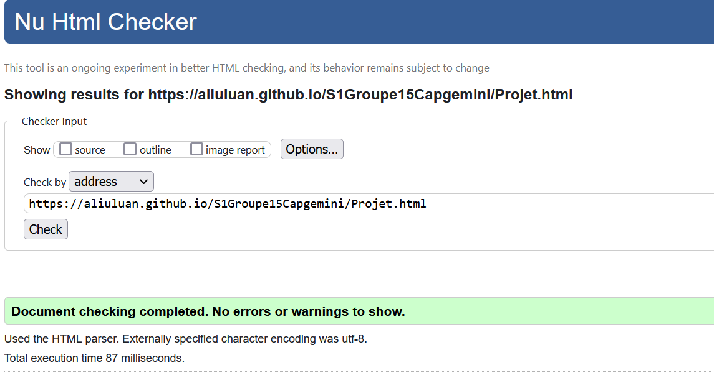

https://aliuluan.github.io/S1Groupe15Capgemini/
# projetcapgemini 

## Capgemini    

[Capgemini](https://aliuluan.github.io/S1Groupe15Capgemini/)

## Membres du groupe :

- [Aigubelle Arthur (référent)](mailto:arthur.aigubelle@edu.univ-fcomte.fr?subject=SAE_1_05_06)  
- [Aliu Luan](mailto:luan.aliu@edu.univ-fcomte.fr?subject=SAE_1_05_06)   
- [Arnoux Romain](mailto:romain.arnoux02@edu.univ-fcomte.fr?subject=SAE_1_05_06)
- [Gaiffe Anna](mailto:anna.gaiffe@edu.univ-fcomte.fr?subject=SAE_1_05_06)   
- [Gueye Awa](mailto:awa.gueye@edu.univ-fcomte.fr?subject=SAE_1_05_06)  

## Présentation 

Ce dépôt correspond à un site web créé en HTML/CSS/JS dans le cadre de la SAÉ 05-06 à l'IUT de Belfort-Montbéliard. Ce site présente des informations concernant l'entreprise Capgemini et sert de vitrine pour présenter l'entreprise, ses activité, son organisation et son historique. Vous trouverez dans ce dépôt et sur le site un rapport économique analysant l'aspect économique de Capgemini. 

## Choix de conception  

Pour la conception du site, nous nous sommes grandement inspirés du site officiel de Capgemini (disponible [ici](https://www.capgemini.com/fr-fr/)), du site d'un de ses principaux concurrents [accenture](https://www.accenture.com/fr-fr/). 

## Développement Site Web et Validation des pages

### Index

**Auteur : Arnoux,Aliu,Aigubelle**  

Vérification W3C : [Détail ICI](https://validator.w3.org/nu/?doc=https%3A%2F%2Faliuluan.github.io%2FS1Groupe15Capgemini%2Findex.html)

 

### Page Histoire

**Auteur : Aigubelle Arthur**  

Vérification W3C : [Détail ICI](https://validator.w3.org/nu/?doc=https%3A%2F%2Faliuluan.github.io%2FS1Groupe15Capgemini%2FHistoire.html)

 

### Page Projet

**Auteur : Gueye Awa**  

Verification W3C : [Détail ICI](https://validator.w3.org/nu/?doc=https%3A%2F%2Faliuluan.github.io%2FS1Groupe15Capgemini%2FProjet.html)

 

### Page Economie

**Auteur : Gaiffe Anna**  

Verification W3C : [Détail ICI](https://validator.w3.org/nu/?doc=https%3A%2F%2Faliuluan.github.io%2FS1Groupe15Capgemini%2FEconomie.html)

 

### Page Activités

**Auteur : Aliu Luan**  

Verification W3C : [Détail ICI](https://validator.w3.org/nu/?doc=https%3A%2F%2Faliuluan.github.io%2FS1Groupe15Capgemini%2FActivit%25C3%25A9s.html)

 

### Page Environnement

**Auteur : Arnoux Romain**  

Verification W3C : [Détail ICI](https://validator.w3.org/nu/?doc=https%3A%2F%2Faliuluan.github.io%2FS1Groupe15Capgemini%2FEnvironnement.html)

 

## Répartition du travail

### Planification - Diagramme de GANTT

- Aigubelle Arthur

### Recherches d'informations

- Gaiffe Anna
- Gueye Awa

### Rapport économique

- Gaiffe Anna
- Gueye Awa
- Aliu Luan
- Aigubelle Arthur
- Arnoux Romain

### Développement site

- Arnoux Romain
  - "Template" de page (Navbar/Footer)
  - Page Environnement
- Aigubelle Arthur
  - Page histoire
- Gaiffe Anna
  - Page Economie
- Gueye Awa
  - Page Projet
- Aliu Luan
  - Page Activités
  - file d'ariane
  - formulaire de contact

### Contribution site

